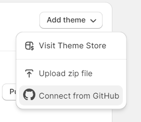
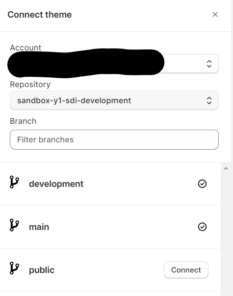

In this step we will prepare our Shopify store and make use of the native github integration. We will use the current live theme and create another development theme and sync both themes with their corresponding github repo and branch as well.

## Theme Setup
We need to make sure to set up at least two themes, the current live theme and a development theme. you can expand this, when you want to add a staging level between. 

### Connect Themes to Github
- Add a new theme to your library

- The live theme will be added to github and its production/main branch.

- The development theme will be added to github and its development branch.

#### Next step